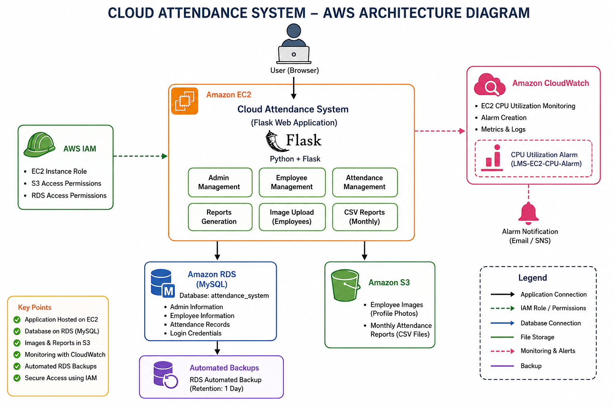

# ☁️ Cloud Attendance System

A cloud-based Employee Attendance Management System developed using **Python Flask** and deployed on **Amazon Web Services (AWS)**. The application enables administrators to manage employees and attendance records while allowing employees to securely record their daily attendance.

---

# Project Overview

The Cloud Attendance System is a web application that simplifies employee attendance management using cloud technologies. It provides a secure platform for employee management, attendance tracking, cloud storage of employee images, report generation, and cloud-based database management.

The application is deployed on Amazon EC2 and uses Amazon RDS for database management, Amazon S3 for image and report storage, and Amazon CloudWatch for monitoring.

---
## Cloud Architecture Diagram



# Features

## Administrator

- Secure Admin Login
- Add Employee
- Edit Employee Details
- Delete Employee
- Upload Employee Photo to Amazon S3
- View Employees
- View Attendance Records
- Filter Attendance
- Export Attendance Reports
- Upload Monthly Attendance Reports to Amazon S3
- Dashboard Statistics

## Employee

- Secure Login
- View Personal Dashboard
- Check-In
- Check-Out
- View Attendance History
- Profile Photo Support

---

# AWS Services Used

## Amazon EC2

- Hosts the Flask web application
- Runs the Python backend

## Amazon RDS (MySQL)

- Stores:
  - Admin Information
  - Employee Information
  - Attendance Records

## Amazon S3

Stores:

- Employee Images
- Monthly Attendance Reports (CSV)

## Amazon CloudWatch

Used for:

- EC2 CPU Monitoring
- Alarm Generation

## Amazon RDS Automated Backup

- Automated database backup enabled

---

# Technology Stack

### Backend

- Python
- Flask
- SQLAlchemy

### Frontend

- HTML5
- Bootstrap 5
- Jinja2

### Database

- MySQL (Amazon RDS)

### Cloud Services

- Amazon EC2
- Amazon RDS
- Amazon S3
- Amazon CloudWatch
- IAM

---

# Project Structure

```
Cloud-Attendance-System/

│
├── app.py
├── config.py
├── models.py
├── requirements.txt
│
├── routes/
│   ├── admin.py
│   ├── employee.py
│   └── home.py
│
├── templates/
│   ├── admin/
│   ├── employee/
│   └── home/
│
├── static/
│
└── README.md
```

---

# Installation

Clone the repository

```bash
git clone <repository-url>
```

Move into the project

```bash
cd Cloud-Attendance-System
```

Create virtual environment

```bash
python -m venv venv
```

Activate virtual environment

Linux

```bash
source venv/bin/activate
```

Windows

```bash
venv\Scripts\activate
```

Install dependencies

```bash
pip install -r requirements.txt
```

Run the application

```bash
python app.py
```

---

# Deployment

The application was deployed using AWS.

### EC2

- Launch Amazon EC2 Instance
- Install Python
- Install Flask
- Clone GitHub Repository
- Install Dependencies
- Run Flask Application

### RDS

- Create MySQL RDS Instance
- Configure Security Groups
- Create Database
- Connect Flask Application

### S3

- Create S3 Bucket
- Store Employee Images
- Store Attendance Reports

### CloudWatch

- Configure EC2 CPU Alarm
- Monitor Instance Performance

---

# Screenshots

Include screenshots of:

- Home Page
- Admin Login
- Admin Dashboard
- Add Employee
- Employee List
- Attendance Page
- Employee Dashboard
- Amazon EC2
- Amazon RDS
- Amazon S3 Bucket
- CloudWatch Alarm

---

# Future Enhancements

- Face Recognition Attendance
- Email Notifications
- SMS Alerts
- Mobile Application
- QR Code Attendance
- Multi-Admin Support

---

# Author

**Abhinand P**

B.Tech Computer Science and Engineering

---

# License

This project is developed for educational purposes.
